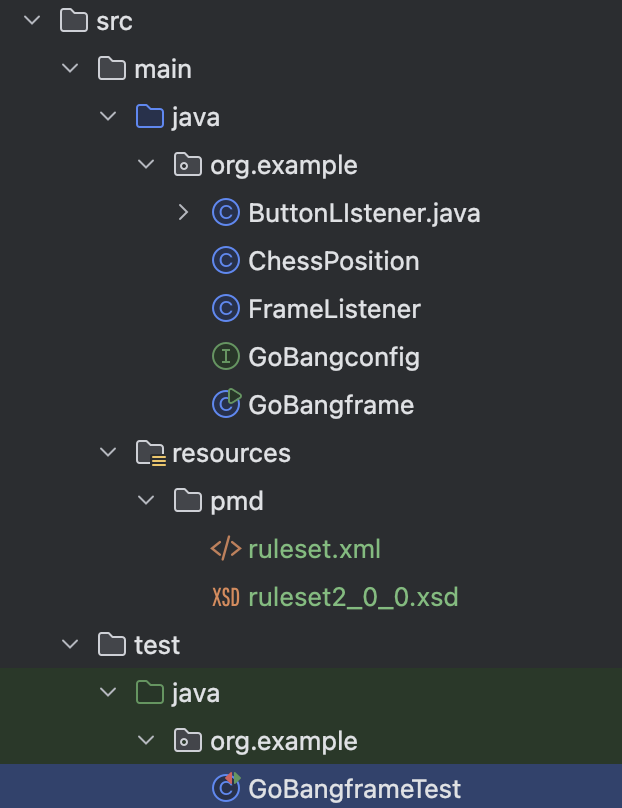

## 測試專案

專案為五子棋遊戲
分成人機與人人對戰模式
先下滿五顆棋子連成一線就勝利了

測試的GitHub

https://github.com/RoWe98/JavaCode/tree/master/wuziqi

## 測試項目

### **遊戲初始化相關**

1. **棋盤初始化**：測試棋盤是否正確設置為全空，所有位置皆可用。
2. **遊戲模式選擇**：驗證「人機對戰」與「人人對戰」模式是否正確啟用及初始化。

---

### **遊戲邏輯測試**

1. **棋子放置**：
    - 測試合法及非法落子的行為，確保：
        - 合法位置能成功放置。
        - 非法落子（位置已被占據）被正確處理。
2. **勝利條件**：
    - 驗證橫向、縱向、對角線（45 度與 135 度方向）五子連線的勝利條件。
    - 包括邊界條件及被中斷的情況。
3. **放棄遊戲**：
    - 確保玩家選擇「放棄」後，遊戲正確結束。

---

### **AI 行為測試**

**人機模式**：驗證 AI 在玩家下棋後能正確進行落子。

---

### **按鈕事件測試**

1. **「新遊戲」按鈕**：測試按下後是否清空棋盤、重置回合並開始新遊戲。
2. **「放棄」按鈕**：驗證放棄按鈕是否能正確結束遊戲。
3. **「作者」與「說明」按鈕**：測試顯示作者資訊或遊戲說明的功能。
4. **「我的 GitHub」按鈕**：驗證按鈕能正確打開 GitHub 網頁。

---

### **邊界條件測試**

**棋盤邊界**：

- 測試落子或勝利條件判斷是否在棋盤邊界範圍內正確執行。
- 測試 null 輸入和各種條件組合的輸出值。

---

### **滑鼠事件測試**

**模擬滑鼠行為**：

- 測試滑鼠點擊、按下、釋放、移入、移出事件是否正確觸發。

---

### **主要做的事情**

- **驗證遊戲核心邏輯**：棋盤初始化、棋子放置、勝利判斷。
- **測試玩家與遊戲互動**：模擬滑鼠行為與按鈕操作。
- **檢查邊界與異常處理**：確保在特殊情況下遊戲正常運作。
- **AI 測試**：檢查人機模式中 AI 的落子邏輯。
- **功能完整性測試**：作者資訊、說明與 GitHub 連結按鈕功能。

## 測試成果

### **檔案結構**



**jacoco與pod**


### 涵蓋度測試

branch≥80%


### jacoco


### code review


# 程式碼解釋

ai下棋邏輯判斷程式

```c
public Integer unionWeight(Integer a, Integer b) {
    if ((a == null) || (b == null)) return 0; // Null 檢查
    else if ((a >= 10) && (a <= 25) && (b >= 10) && (b <= 25)) return 60; // 條件一一
    else if (((a >= 10) && (a <= 25) && (b >= 60) && (b <= 80)) || ((a >= 60) && (a <= 80) && (b >= 10) && (b <= 25))) return 800; // 一二、二一
    else if (((a >= 10) && (a <= 25) && (b >= 140) && (b <= 1000)) || ((a >= 140) && (a <= 1000) && (b >= 10) && (b <= 25)) || ((a >= 60) && (a <= 80) && (b >= 60) && (b <= 80))) return 3000; // 一三、三一、二二
    else if (((a >= 60) && (a <= 80) && (b >= 140) && (b <= 1000)) || ((a >= 140) && (a <= 1000) && (b >= 60) && (b <= 80))) return 3000; // 二三、三二
    else return 0; // 預設值
}
```

測試程式