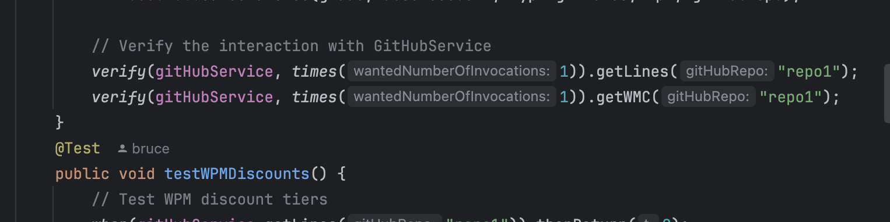

# 第一題

主程式

```java
package org.example;

public class FitnessClub {

    private GitHubService gitHubService;

    public FitnessClub(GitHubService gitHubService) {
        this.gitHubService = gitHubService;
    }

    public int calculateFee(int grade, int absenceCount, int typingMinutes, int wpm, String gitHubRepo) {
        if (grade < 2) {
            throw new IllegalArgumentException("Grade must be >= 2");
        }

        int baseFee = 500;
        int discount = 0;

        // Absence discount
        if (absenceCount < 5) {
            discount += 50;
        }

        // WPM discount
        if (wpm > 100) {
            discount += 150;
        } else if (wpm > 80) {
            discount += 100;
        } else if (wpm > 60) {
            discount += 50;
        }

        // Typing minutes discount based on grade
        if (grade == 2 && typingMinutes >= 5) {
            discount += (typingMinutes >= 10 ? 200 : 100);
        } else if (grade == 3 && typingMinutes >= 10) {
            discount += (typingMinutes >= 15 ? 200 : 100);
        } else if (grade == 4 && typingMinutes >= 15) {
            discount += (typingMinutes >= 20 ? 200 : 100);
        }

        // GitHub repo discount (for grade >= 2)
        // GitHub repo discount
        int lines = gitHubService.getLines(gitHubRepo);
        int wmc = gitHubService.getWMC(gitHubRepo);
        if (grade == 2) {
            discount += (lines / 1000) * 50;
            discount = Math.min(discount, 200);
        } else if ( wmc > 50) {
            discount += (lines / 1000) * 50;
            discount = Math.min(discount, 200);
        }

        // Final fee calculation
        int finalFee = baseFee - discount;
        return Math.max(finalFee, 0); // Fee cannot be negative
    }
}
```

介面

```java
package org.example;

public interface GitHubService {
    int getLines(String gitHubRepo);
    int getWMC(String gitHubRepo);
}
```

測試程式

```java
package org.example;
import static org.mockito.Mockito.*;
import static org.junit.jupiter.api.Assertions.*;

import org.junit.jupiter.api.BeforeEach;
import org.junit.jupiter.api.Test;
import org.mockito.*;

public class FitnessClubTest {

    @Mock
    private GitHubService gitHubService;

    private FitnessClub fitnessClub;

    @BeforeEach
    public void setUp() {
        MockitoAnnotations.openMocks(this);
        fitnessClub = new FitnessClub(gitHubService);
    }

    @Test
    public void testCalculateFee_WithAllDiscounts() {
        // Setup mock responses for GitHubService
        when(gitHubService.getLines("repo1")).thenReturn(5000); // 5k lines
        when(gitHubService.getWMC("repo1")).thenReturn(60); // wmc > 50

        // Test data
        int grade = 3;
        int absenceCount = 3;
        int typingMinutes = 12;
        int wpm = 85;
        String gitHubRepo = "repo1";

        // Calculate fee
        int fee = fitnessClub.calculateFee(grade, absenceCount, typingMinutes, wpm, gitHubRepo);

        // Check the fee calculations
        assertEquals(300, fee); // Base fee 500 - all discounts
    }

    @Test
    public void testCalculateFee_NoDiscounts() {
        // Test data
        int grade = 2;
        int absenceCount = 6; // No absence discount
        int typingMinutes = 4; // No typing discount
        int wpm = 50; // No typing speed discount
        String gitHubRepo = "repo1";

        // Setup mock response for GitHubService
        when(gitHubService.getLines("repo1")).thenReturn(1000); // 1k lines
        when(gitHubService.getWMC("repo1")).thenReturn(30); // wmc < 50

        // Calculate fee
        int fee = fitnessClub.calculateFee(grade, absenceCount, typingMinutes, wpm, gitHubRepo);

        // Check the fee calculations
        assertEquals(450, fee); // No discounts, should be 500
    }

    @Test
    public void testCalculateFee_InvalidGrade() {
        // Test for invalid grade
        assertThrows(IllegalArgumentException.class, () -> {
            fitnessClub.calculateFee(1, 3, 10, 70, "repo1");
        });
    }

    @Test
    public void testGitHubServiceInteraction() {
        // Setup mock responses for GitHubService
        when(gitHubService.getLines("repo1")).thenReturn(5000); // 5k lines
        when(gitHubService.getWMC("repo1")).thenReturn(60); // wmc > 50

        // Test data
        int grade = 3;
        int absenceCount = 3;
        int typingMinutes = 12;
        int wpm = 85;
        String gitHubRepo = "repo1";

        // Calculate fee
        fitnessClub.calculateFee(grade, absenceCount, typingMinutes, wpm, gitHubRepo);

        // Verify the interaction with GitHubService
        verify(gitHubService, times(1)).getLines("repo1");
        verify(gitHubService, times(1)).getWMC("repo1");
    }
    @Test
    public void testWPMDiscounts() {
        // Test WPM discount tiers
        when(gitHubService.getLines("repo1")).thenReturn(0);
        when(gitHubService.getWMC("repo1")).thenReturn(0);

        // Below 60 WPM - no discount
        int fee1 = fitnessClub.calculateFee(2, 0, 0, 50, "repo1");
        assertEquals(450, fee1);

        // Exactly 60 WPM - no discount
        int fee2 = fitnessClub.calculateFee(2, 0, 0, 60, "repo1");
        assertEquals(450, fee2);

        // Just above 60 WPM - 50 discount
        int fee3 = fitnessClub.calculateFee(2, 0, 0, 61, "repo1");
        assertEquals(400, fee3);

        // Exactly 80 WPM - 50 discount
        int fee4 = fitnessClub.calculateFee(2, 0, 0, 80, "repo1");
        assertEquals(400, fee4);

        // Just above 80 WPM - 100 discount
        int fee5 = fitnessClub.calculateFee(2, 0, 0, 81, "repo1");
        assertEquals(350, fee5);

        // Exactly 100 WPM - 100 discount
        int fee6 = fitnessClub.calculateFee(2, 0, 0, 100, "repo1");
        assertEquals(350, fee6);

        // Just above 100 WPM - 150 discount
        int fee7 = fitnessClub.calculateFee(2, 0, 0, 101, "repo1");
        assertEquals(300, fee7);
    }

    @Test
    public void testTypingMinutesDiscounts() {
        // Test typing minutes for different grades
        when(gitHubService.getLines("repo1")).thenReturn(0);
        when(gitHubService.getWMC("repo1")).thenReturn(0);

        // Grade 2 - Typing Minutes Discount
        int fee1 = fitnessClub.calculateFee(2, 0, 5, 70, "repo1");
        assertEquals(300, fee1);

        int fee2 = fitnessClub.calculateFee(2, 0, 10, 70, "repo1");
        assertEquals(300, fee2);

        // Grade 3 - Typing Minutes Discount
        int fee3 = fitnessClub.calculateFee(3, 0, 10, 70, "repo1");
        assertEquals(300, fee3);

        int fee4 = fitnessClub.calculateFee(3, 0, 15, 70, "repo1");
        assertEquals(200, fee4);

        // Grade 4 - Typing Minutes Discount
        int fee5 = fitnessClub.calculateFee(4, 0, 15, 70, "repo1");
        assertEquals(300, fee5);

        int fee6 = fitnessClub.calculateFee(4, 0, 20, 70, "repo1");
        assertEquals(200, fee6);
        int fee7 = fitnessClub.calculateFee(4, 0, 10, 70, "repo1");
        assertEquals(400, fee7);
    }

    @Test
    public void testGitHubRepositoryDiscounts() {
        // Test GitHub repository discounts for different grades
        when(gitHubService.getWMC("repo1")).thenReturn(60); // Above threshold for grades > 2

        // Grade 2 - Discount based on lines
        int fee1 = fitnessClub.calculateFee(2, 0, 0, 70, "repo1");
        when(gitHubService.getLines("repo1")).thenReturn(1000);
        assertEquals(400, fee1);

        when(gitHubService.getLines("repo1")).thenReturn(5000); // Max 200 discount
        int fee2 = fitnessClub.calculateFee(2, 0, 0, 70, "repo1");
        assertEquals(300, fee2);

        // Grade 3 - Discount with WMC condition
        when(gitHubService.getWMC("repo1")).thenReturn(30); // Below threshold
        int fee3 = fitnessClub.calculateFee(3, 0, 0, 70, "repo1");
        when(gitHubService.getLines("repo1")).thenReturn(1000);
        assertEquals(400, fee3);

        when(gitHubService.getWMC("repo1")).thenReturn(60); // Above threshold
        int fee4 = fitnessClub.calculateFee(3, 0, 0, 70, "repo1");
        when(gitHubService.getLines("repo1")).thenReturn(5000); // Max 200 discount
        assertEquals(350, fee4);
    }

}
```

（O）以 Java 完成以上程式。由 gitHubRepo 取得 lines 和 wmc 的部分請宣告一個介面
(GitHubService) 來進行。(Hit: GitHubService.getLines(); GitHubservice.getWMC())
（O）以 JUnit 進行測試; 透過 Mokito 的方式針對 GitHubService 進行測試的假設。
（O）透過 Mokito 的 verify() 檢驗程式的互動


（O）若無法編寫 Mokito 則自行撰寫一個類別進行假設資料
（O）透過 JUnit 進行白箱測試，Branch coverage 達到 100%

（O）產生 Jacoco 涵蓋度報告


